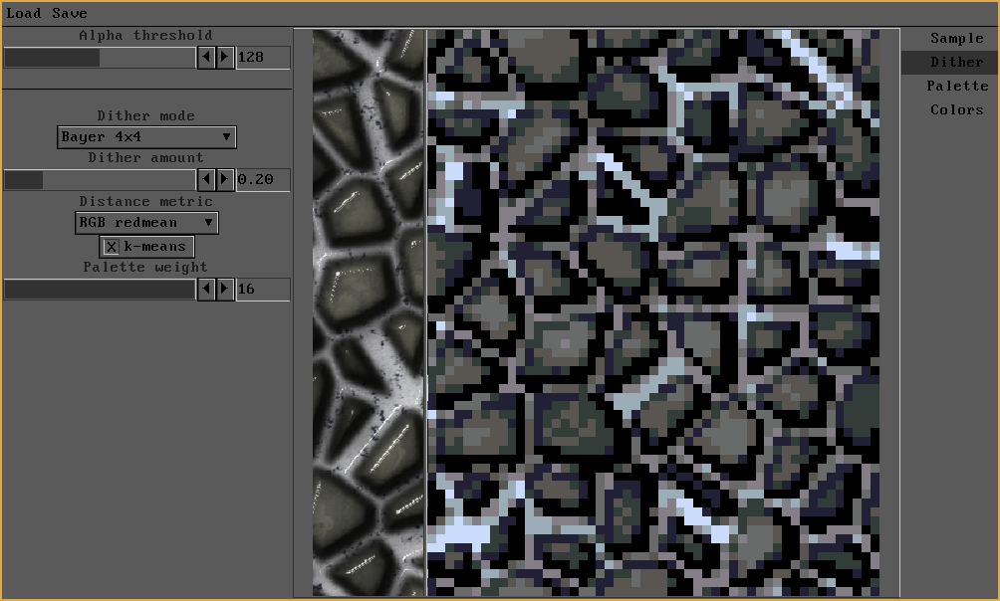
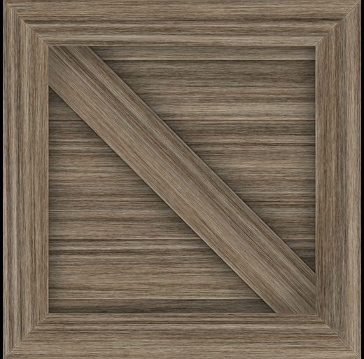

# SoftLK-tools

This repo hosts the source code for different (currently two) tools that were made to be used with SoftLK-lib.

## SLK_img2pixel (v1.2)

A tool for transforming images into pixel art.

## SLK_make (WIP)

A build system based on the one used by golgotha (which was cancelled and released into the public domain).
Warning: SLK_make is still very much experimental, it will not work for any operating system except linux.

# Building from source

* First, clone this repository: ``https://github.com/Captain4LK/SoftLK-tools.git``

## Dependencies

In general, I try to keep the amount of external dependencies as low as possible, but some are still needed, as listed below.

* [SDL2](https://www.libsdl.org/download-2.0.php)

## Using sh scripts

* cd into the directory of the tool you want to build
* run the shell script associated with your platform, e.g: ``sh linux.sh``
* The binary can be found at the top level of the repo in the bin directory

# Contact

Here is a link to the SLK_img2pixel Discord. Feel free to pop in and make suggestions or ask questions: https://discord.gg/Nch8hjdZ2V

# Download 

* SLK_img2pixel: [itch.io](https://captain4lk.itch.io/slk-img2pixel)

# License

All code in this repository (except the 'external' directory containing source code not by me) is released into the public domain (CC0), see COPYING for more info.

# Planned tools / ideas

* tile map editor
* pixel art editor

# Third party libraries

* [tinyfiledialogs](https://sourceforge.net/projects/tinyfiledialogs/), zlib, for all builds except windows
* [cute_files](https://github.com/RandyGaul/cute_headers), zlib/unlicense
* [cute_path](https://github.com/RandyGaul/cute_headers), zlib/unlicense
* [cute_png](https://github.com/RandyGaul/cute_headers), zlib/unlicense
* [stb_image](https://github.com/nothings/stb), mit/unlicense
* [gifenc](https://github.com/lecram/gifenc), public domain
* [gifdec](https://github.com/lecram/gifdec), public domain
* [fopen_utf8](https://github.com/Photosounder/fopen_utf8/), only for windows builds, public domain
* [Native File Dialog Extended](https://github.com/btzy/nativefiledialog-extended), only for windows builds, zlib
