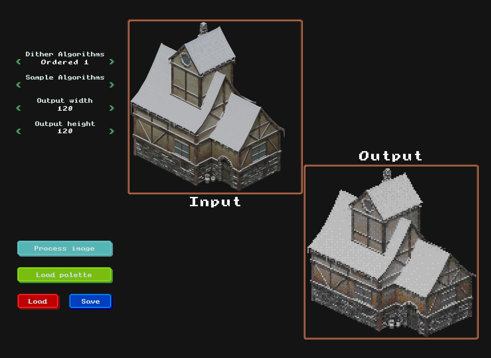

# SLK_img2pixel

A tool for transforming images into pixel art.

A image of an isometric building downsized to a resolution of 128x128 pixels.

# License

All code in this repository (except the 'external' directory) is released into the public domain (CC0), see LICENSE for more info.

# Third party libraries

* [tinyfiledialogs](https://sourceforge.net/projects/tinyfiledialogs/), zlib
